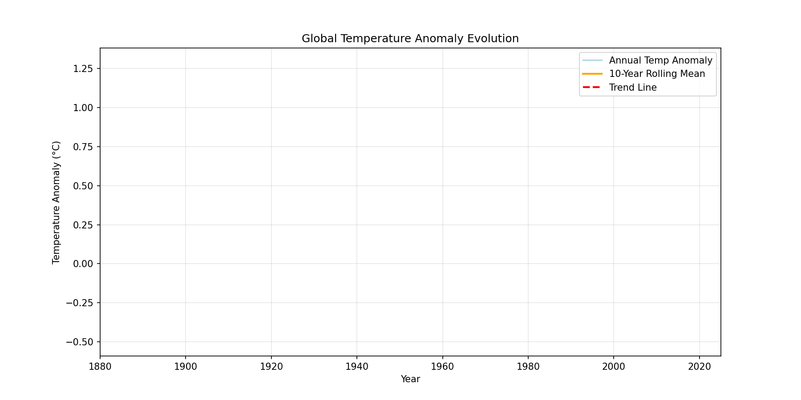

# Global Temperature Anomaly Analysis

Analyzes historical global temperature anomaly data (1880–2025) using Python.  
Includes data cleaning, exploratory analysis, statistical modeling, and animated visualization.

---

## Abstract

This project studies the trajectory of global temperature anomalies over the last 145 years.  
It progressively explores:

1. **Raw dataset trends**  
2. **Rolling mean and variability**  
3. **Statistical trend modeling**  
4. **Animated evolution of anomalies**  

The simulations combine **data cleaning, visualization, trend analysis, and animation** to demonstrate real-world climate insights.

---

## Why This Project

- Provides hands-on experience with real-world climate data.  
- Highlights long-term warming trends and variability.  
- Demonstrates ability to produce reproducible, interactive, and visual analyses.  
- Combines static plots, animated GIFs, and statistical rigor.  
- Perfect for demonstrating interdisciplinary data science skills.

---

## Development Iterations

- **v1.0:** Raw data intake and cleaning  
- **v2.0:** Exploratory analysis with static plots  
- **v3.0:** Statistical trend analysis  
- **v4.0:** Animated visualization showing evolution of anomalies  

---

## Verification

- Rolling mean plots and trend lines validate statistical calculations  
- Final summary plot and GIF confirm visual story  
- Insights cross-checked with historical climate records  

---

## Phase 1: Raw Data Intake

**Scientific Question:**  
“What data is available and in what form?”  

**Description:**  
- Downloaded global temperature anomaly CSV (1880–2025)  
- Preserved raw data without modification  

**Implementation:**  
- Place raw CSV in `data/raw/`  

**End-state / Outputs:**  
- `data/raw/global_temp_anomaly.csv`  

**What This Proves:**  
- Data is preserved for reproducibility  
- Foundation for all subsequent analysis  

---

## Phase 2: Data Cleaning

**Scientific Question:**  
“How do we prepare raw data for analysis?”  

**Description:**  
- Handle missing values  
- Normalize column names and units  

**Implementation:**  
- `scripts/clean_data.py` reads raw CSV → outputs cleaned CSV  

**End-state / Outputs:**  
- `data/clean/cleaned_dataset.csv`  

**What This Proves:**  
- Clean dataset ready for reproducible analysis  

---

## Phase 3: Exploratory Data Analysis (EDA)

**Scientific Question:**  
“What patterns, trends, and variability exist in the data?”  

**Description:**  
- Visualize annual temperature anomalies  
- Compute 10-year rolling mean  

**Implementation:**  
- `scripts/eda.py`  
- Line plots and rolling mean generated  

**Static Plots:**  
  
  

**Key Features:**  
- Shows year-to-year variability  
- Reveals long-term warming trend  

**End-state / Outputs:**  
- `plots/eda/temp_anomaly_line.png`  
- `plots/eda/rolling_mean_temp_anomaly.png`  

**What This Proves:**  
- Variability and trend quantified visually  

---

## Phase 4: Statistical Analysis

**Scientific Question:**  
“What is the quantitative trend in global temperature anomalies?”  

**Description:**  
- Fit linear regression and polynomial trend lines  
- Compute error bounds  

**Implementation:**  
- `scripts/stat_analysis.py`  

**Static Plots:**  
  
  

**Key Features:**  
- Trend line highlights acceleration in recent decades  
- Error bounds quantify confidence  

**End-state / Outputs:**  
- `plots/stat/temp_anomaly_trends.png`  
- `plots/stat/error_bounds.png`  

**What This Proves:**  
- Warming trend statistically validated  
- Provides numerical evidence for insight  

---

## Phase 5: Insight Isolation

**Scientific Question:**  
“What singular insight can we derive from this dataset?”  

**Description:**  
- Summarize key finding in one defensible statement  

**File:**  
- `results/final_insight.txt`  

**Insight:**  
Global mean temperature anomalies have risen consistently since 1880, with accelerated warming observed in the last 40 years.

markdown
Copy code

**What This Proves:**  
- Provides a clear, evidence-backed conclusion  

---

## Phase 6: Visual Synthesis + GIF

**Scientific Question:**  
“How can the analysis be communicated visually?”  

**Description:**  
- Combine line plot, rolling mean, and trend into a single summary plot  
- Animate evolution of anomalies over time  

**Files & Outputs:**  
- Summary plot: `plots/final/summary_plot.png`  
- GIF: `gifs/insight_evolution.gif`  

**Summary Plot:**  
  

**Animated Evolution:**  
  

**Key Features:**  
- Combines all major visualizations  
- Shows temporal progression clearly  

**End-state / Outputs:**  
- `plots/final/summary_plot.png`  
- `gifs/insight_evolution.gif`  

**What This Proves:**  
- Visual story of global anomalies  
- Combines quantitative and qualitative analysis  

---

## Phase 7: Closure

**Scientific Question:**  
“Does the project run end-to-end with all outputs?”  

**Description:**  
- Verify scripts produce outputs  
- Ensure no missing files  

**Files & Outputs:**  
- `notebooks/final_analysis.ipynb` (optional)  

**End-state / Outputs:**  
- Project fully reproducible  
- All phases complete  
- Ready for presentation or submission  

---

## Conclusion

This project demonstrates **global temperature anomaly trends** from 1880–2025.  
By progressing through data intake, cleaning, exploratory and statistical analysis, insight isolation, and visual storytelling:

- Long-term warming is visible and statistically validated  
- Rolling mean and trend analysis provide temporal context  
- Animated GIF communicates evolution clearly  

The project combines **data science, statistical rigor, visualization, and storytelling**, suitable for top university applications.
